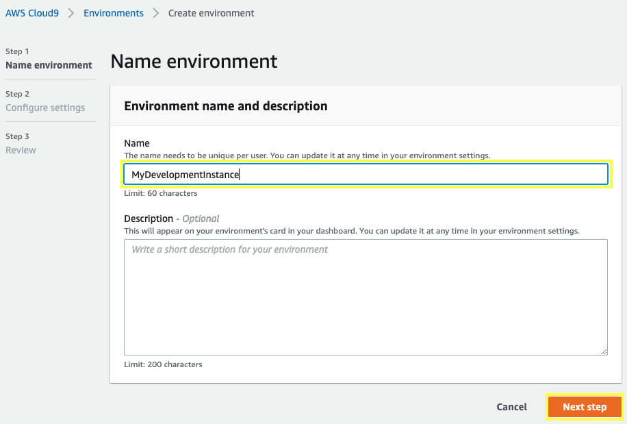
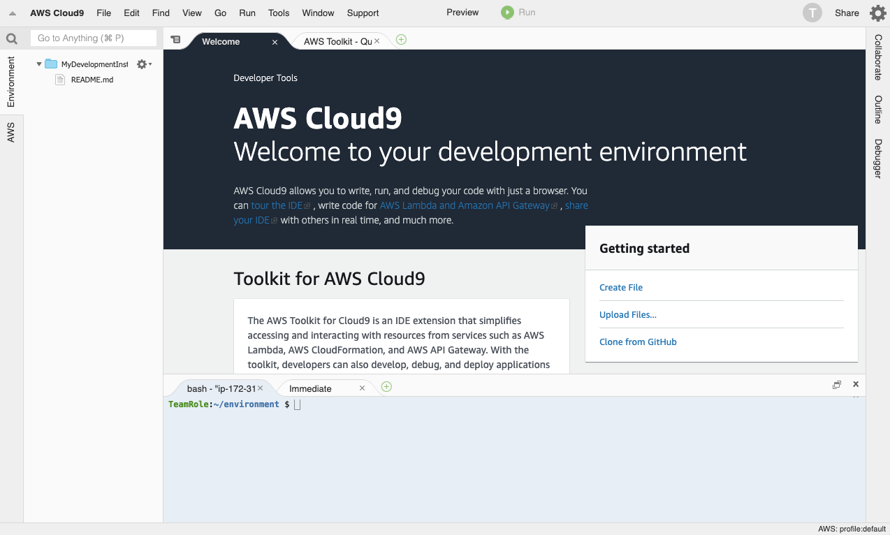
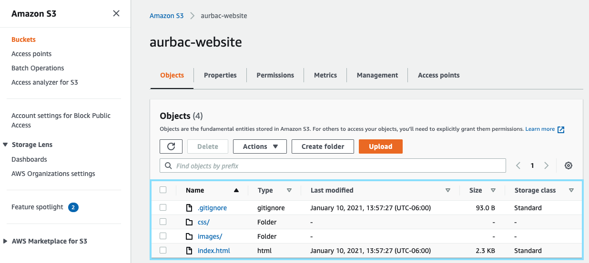

[AWS Cloud9](https://aws.amazon.com/cloud9/) is a cloud-based integrated development environment (IDE) that lets you write, run, and debug your code with just a browser. It combines the rich code editing features of an IDE such as code completion, hinting, and step-through debugging, with access to a full Linux server for running and storing code.

2.1\. Open the AWS Cloud9 console at https://console.aws.amazon.com/cloud9/.

2.2\. Click on **Create environment**.


2.3\. For the **Name** type `MyDevelopmentInstance`, and choose **Next step**.



2.4\. For the **Environment settings** use the default values and choose **Next step**.

2.5\. Click on **Create environment**.

2.6\. Wait a few seconds until your development environment is ready, you will see the following screen.



2.7\. Inside the bash terminal execute the following commands:

* Download static website from github.
```console
git clone https://github.com/aurbac/static-website.git
```
* Upload static website, change **`<your-name>-website`** with your bucket name.
```console
aws s3 cp static-website/ s3://<your-name>-website/ --recursive --exclude ".git/*" --acl public-read
```

2.8\. Open the Amazon S3 console at [https://console.aws.amazon.com/s3/](https://console.aws.amazon.com/s3/), open your Amazon S3 bucket, you will see the files uploaded.


