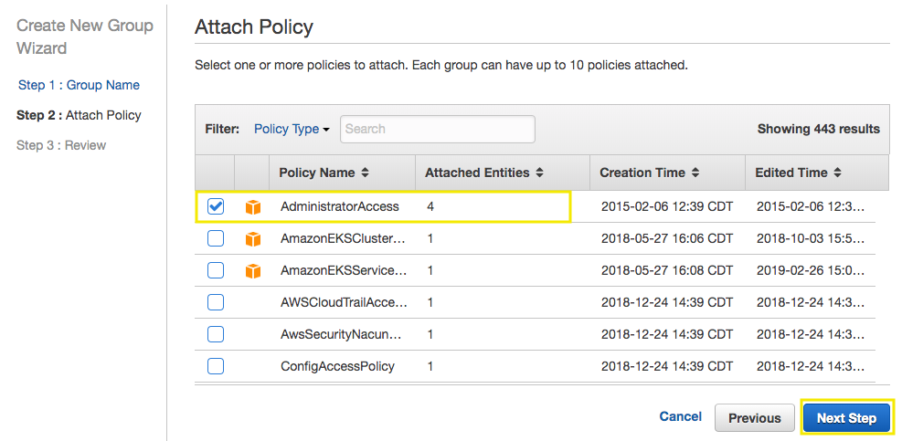
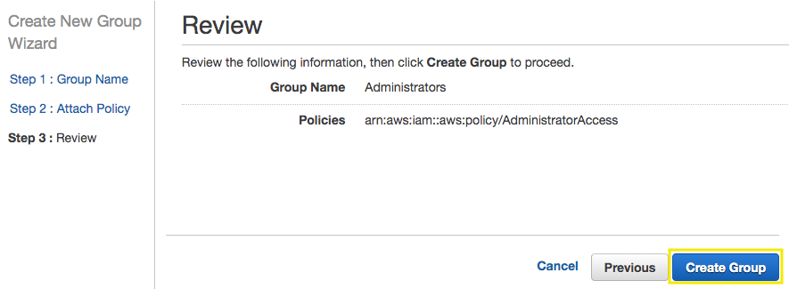

# Getting Started with Identity & Access Management

## 1. Create an IAM Group

1.1\. Open the IAM console at https://console.aws.amazon.com/iam/.

1.2\. In the navigation pane, click **Groups** and then click **Create New Group**.

1.3\. In the **Group Name** box, type `Administrators` as the name of the group and then click **Next Step**.

1.4\. In the list of policies, select the check box for **AdministratorAccess** policy that you want to apply to all members of the group. Then click **Next Step**.

1.5\. Click **Create Group**.

## 2. Create an IAM User

2.1\. Open the IAM console at https://console.aws.amazon.com/iam/.

2.2\. In the navigation pane, choose **Users** and then choose **Add user**.

2.3\. In the **User Name** box, type `Admin1` as the name of the user, for **Access type** select the check box **AWS Management Console access** and then click **Next: Permissions**.

2.4\. On the **Set permissions** page, select the check box for **Administrators** group and then click **Next: Tags**.

2.5\. Choose **Next: Review** to see all of the choices you made up to this point. When you are ready to proceed, choose **Create user**.

2.6\. To save the credentials, choose **Download .csv** and then save the file to a safe location, and **Close**.

!!! info
    Open the csv file and use the new credentials to get into your AWS Console with administrator access.