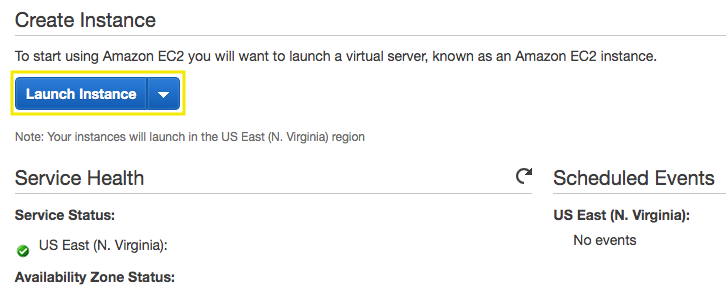
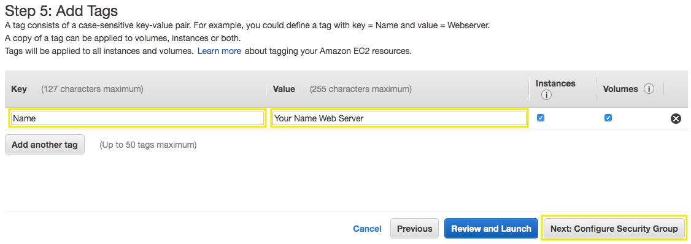
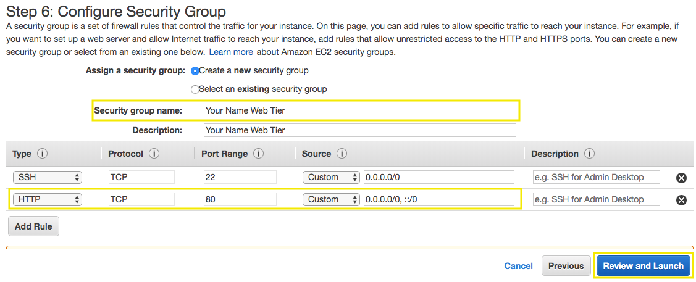
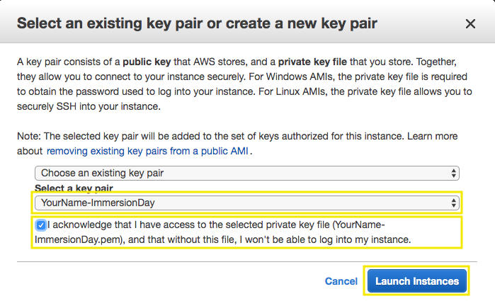
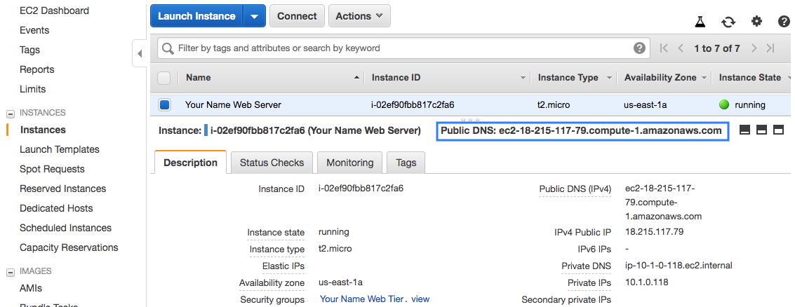

# Getting Started with Linux on Amazon EC2

This lab will walk you through launching, configuring, and customizing an EC2 web server using the AWS Management Console.

## 1. Create a new Key Pair

In this lab, you will need to create an EC2 instance using an SSH keypair. The following steps outline creating a unique SSH keypair for you to use in this lab.

1.1\. Sign into the AWS Management Console and open the Amazon EC2 console at https://console.aws.amazon.com/ec2.

1.2\. In the upper-right corner of the AWS Management Console, confirm you are in the desired AWS region (e.g., Virginia).

1.3\. Click on **Key Pairs** in the **NETWORK & SECURITY** section near the bottom of the leftmost menu. This will display a page to manage your SSH key pairs.

1.4\. To create a new SSH key pair, click the **Create Key Pair** button at the top of the browser window.

1.5\. In the resulting pop up window, type [First Name]-[Last Name]-ImmersionDay into the **Key Pair Name:** text box and click **Create**.


1.6\. The page will download the file "[Your-Name]-ImmersionDay.pem" to the local drive. Follow the browser instructions to save the file to the default download location.

1.7\. Remember the full path to the file .pem file you just downloaded.

**Note:** You will use the Key Pair you just created to manage your EC2 instances for the rest of the lab.

## 2. Launch a Web Server Instance

In this example we will launch an Amazon Linux 2 instance, bootstrap Apache/PHP, and install a basic web page that will display information about our instance.

2.1\. Sign into the AWS Management Console and open the Amazon EC2 console at https://console.aws.amazon.com/ec2.

2.2\. Click on **Launch Instance**.



2.3\. In the **Quick Start** section, select the first Amazon Linux 2 AMI and click **Select**.


2.4\. In the Choose Instance Type tab, select the **t2.micro** instance size and click **Next: Configure Instance Details**.


2.5\. On the **Configure Instance Details** page, select your network **My VPC** created and the **Public Subnet 01**, for Auto-assign Public IP select **Enable**, expand the **Advanced Details** section, copy/paste the script below into the **User Data** field (this shell script will install Apache & PHP, start the web service, and deploy a simple web page). Click **Next: Add Storage**.

```console
#include
https://s3.amazonaws.com/immersionday-labs/bootstrap.sh
```


2.6\. On this page you have the ability to modify or add storage and disk drives to the instance. For this lab, we will simply accept the storage defaults and click **Next: Add Tags**.

2.7\. Here, we choose a “friendly name” for your instance by choosing **Add Tag**. Tag it with **Key**: `Name` and  **Value**: `[Your Name] Web Server`. It makes it easy to keep track of running machines in a complex environment. Click **Next: Configure Security Group**.



2.8\. You will be prompted to create a new security group, which will be your firewall rules. On the assumption that we are building out a Web server, name your new security group `[Your Name] Web Tier`, and confirm an existing **SSH** rule exists which allows **TCP** port **22** from Anywhere. Click **Add Rule**:

2.9\. Select HTTP from the **Type** dropdown menu, and confirm **TCP** port **80** is allowed from Anywhere (you’ll notice, that “Anywhere is the same as ‘0.0.0.0/0’).  Click **Add Rule**. 

2.10\. Click the **Review and Launch** button after configuring the security group.



2.11\. Review your cofiguration and choices, and then click **Launch**.

2.12\. Select the key pair that you created in the beginning of this lab from the drop-down and check the **I acknowledge** checkbox. Then click the **Launch Instances** button.



2.13\. Click the **View Instances** button in the lower righthand portion of the screen to view the list of EC2 instances. Once your instance has launched, you will see your Web Server as well as the Availability Zone the instance is in, and the publicly routable DNS name.

2.14\. Click the checkbox next to your web server to view details about this EC2 instance.

## 3. Browse the Web Server

3.1\. Wait for the instance to pass the Status Checks to finish loading.

3.2\. Open a new browser tab and browse the Web Server by entering the EC2 instance’s Public DNS name into the browser.  The EC2 instance’s Public DNS name can be found in the console by reviewing the “Public DNS” name line highlighted above.



You should see a website that looks like the following:


**Great Job! You have deployed a server and launched a web site in a matter of minutes!!**