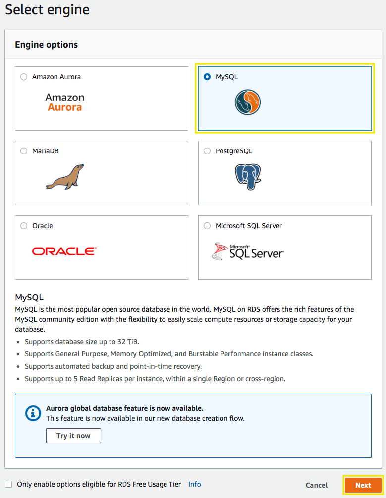
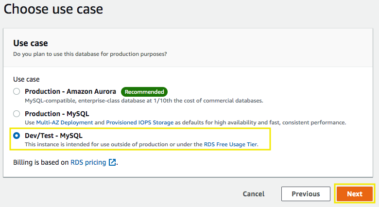
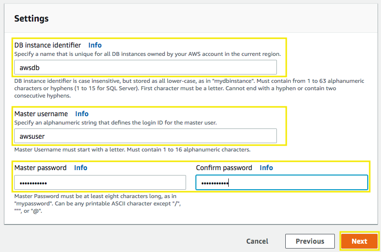
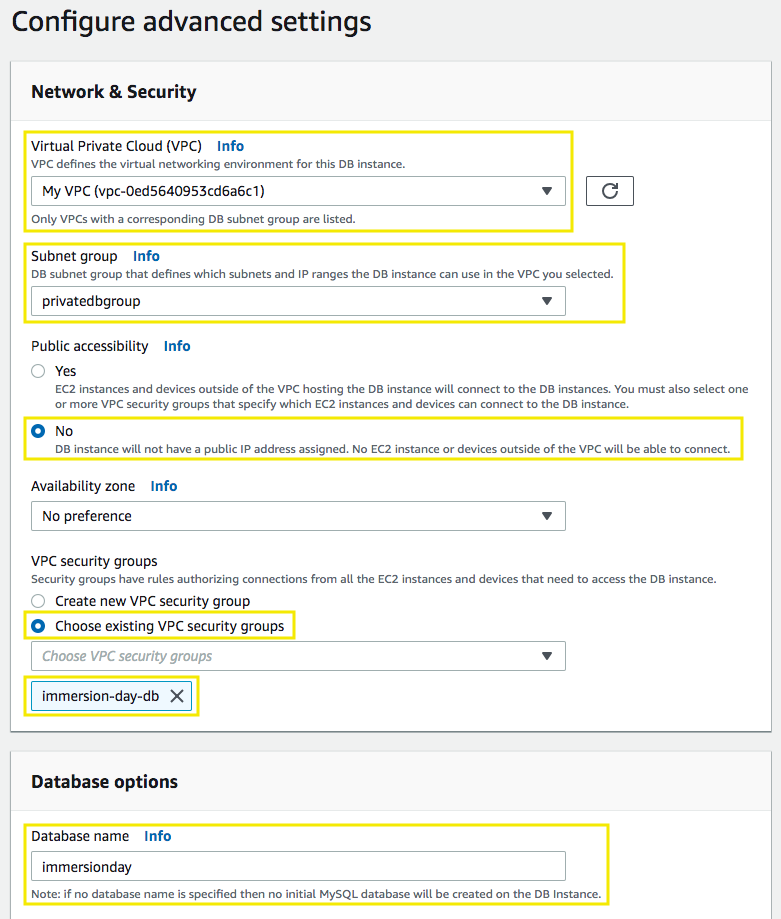
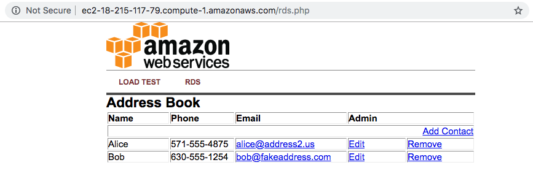

# Getting Started with Amazon RDS

## 1. Create the Security Group

1.1\. Open the Amazon VPC console at https://console.aws.amazon.com/vpc/.

1.2\. Choose **Create security group**.

1.3\. For the **Security group name** and **Description** type `immersion-day-db`. For **VPC** select your VPC ID **My VPC**, and choose **Create** and **Close**.

1.4\. Select the security group **immersion-day-db**.

1.5\. On the **Inbound Rules** tab, choose **Edit rules**.

1.6\. In the dialog, choose **Add Rule** and add the following rules:

•	**Type:** `MYSQL/Aurora`

•	**Protocol:** `TCP`

•	**Port Range:** `3306`

•	**Source:** `Custom sg-XXXXXXX` Type `sg-` and select the security group ID for **Your Name Web Tier**

1.7\. Choose **Save rules** and **Close**.

## 2. Create a Subnet Group

2.1\.	Open the Amazon RDS console at  https://console.aws.amazon.com/rds.

2.2\.	Click on **Subnet groups** and click on **Create DB Subnet Group**.

2.3\.	For **Name** and **Description** type `PrivateDBGroup`.

2.4\.	For the VPC select **My VPC**.

2.5\.	In **Add subnets** section, select the Private Subnets, from **us-east-1a** select **10.1.2.0/24** (Private Subnet 01), choose **Add subnet** and for **us-east-1b** select **10.1.3.0/24** (Private Subnet 02), choose **Add subnet**.

2.6\.	Choose **Create**.

## 3. Launch an RDS Instance

Now that our VPC security group and subnet group are ready, let’s configure and launch a MySQL RDS Instance.

3.1\. Open the Amazon RDS console at  https://console.aws.amazon.com/rds.

3.2\. Click on **Create database**.

3.3\. We will be using a MySQL database, so choose **MySQL** from the available engines.

3.4\. Click **Next**.

3.5\. Check **Dev/Test - MySQL** for the Use Case, at the bottom of the page, and then click **Next**.

3.6\. Fill out the DB Instance details with the following information and click **Next**:

•	**DB engine version:** `Use the default engine version`

•	**DB Instance class:** `db.t2.micro`

•	**Storage type:** `General Purpose (SSD)`

•	**Allocated Storage:** `20 GB`

•	**DB instance identifier:** `awsdb`

•	**Master username:** `awsuser`

•	**Master Password:** `awspassword`

3.7\. In **Configure Advanced Settings**, fill out Network & Security with the following information:

•	**Virtual Private Cloud (VPC):** `My VPC`

•	**Subnet group:** `privatedbgroup`

•	**Public accessibility:** `No`

•	**Availability zone:** `No Preference`

•	**VPC security groups:** Select **Choose existing VPC security groups**, then pick `immersion-day-db`, remove the default security group.

•	**Database nema:** `immersionday`.

3.8\. Choose **Create database** and **View DB instance details**. In the RDS Dashboard, monitor your new DB instance until the status changes from “creating” to “backing up” to “available”. 

**Note**: This may take up to 5 minutes as the database is being created and backed up, once is available you can continue.

3.9\. Go to https://console.aws.amazon.com/rds, choose **Databases** and choose your database ****  

3.10\. From the **Connectivity & security** description, copy the **Endpoint** once is available, you will use it in the next section.

## 4. Configure Instance to Leverage RDS

We provided an example database table and sample code for creating a simple address book.  Before configuring your instance, you will need to get the URL for your database endpoint.

4.1\. In the RDS console, click on **Instances** and then select your database instance, **awsdb**.

4.2\. Scroll down to the Connect section and check the value under **Endpoint**. Remember this because you will need it in a minute.

4.3\. Navigate to the browser tab connected to web application you launched previously in [Getting Started with Linux on Amazon EC2]((EC2LinuxHandsOnLab.md "Amazon EC2")) lab (or open a new tab and reconnect to your web server’s URL) and click on **RDS**. You should see a prompt to enter the **DB Endpoint**, **username** (`awsuser`), **password** (`awspassword`) and **database** (`immersionday`) information you just created. Click the **Submit** button.

4.4\. When complete, you will be redirected to a simple page displaying all of the information from the database you just created.

This is a very basic example of a simple address book interacting with a MySQL database managed by AWS.  RDS can support much more complicated relational database scenarios, but we hope this simple example will suffice to demonstrate the point.

Feel free to play around with the address book and add/edit/remove content from your RDS database by using the Add Contact, Edit, and Remove links in the Address Book.

**Great Job: You have successfully deployed and utilized an AWS managed MySQL database!!!**