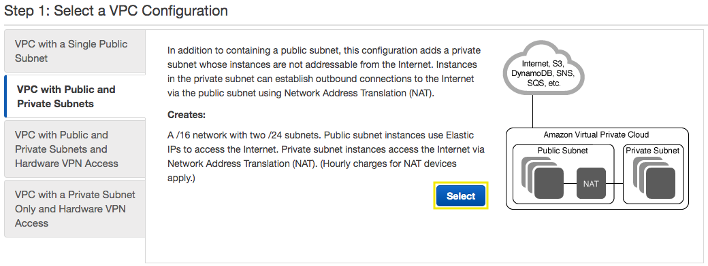

# Getting Started with Amazon VPC

## 1. Create an Elastic IP for the NAT Gateway

1.1\. Open the Amazon EC2 console at https://console.aws.amazon.com/ec2/.

1.2\. In the navigation pane, choose **Elastic IPs**.

1.3\. Choose **Allocate new address**.

1.4\. For **IPv4 address pool**, choose **Amazon pool**.

1.5\. Choose **Allocate**, and close the confirmation screen.

## 2. Create a VPC using the Amazon VPC Wizard

2.1\. Open the Amazon VPC console at https://console.aws.amazon.com/vpc/.

2.2\. In the navigation pane, choose **VPC Dashboard**. From the dashboard, choose **Launch VPC Wizard**.

2.3\. Choose the second option, **VPC with Public and Private Subnets**, and then choose **Select**.

2.4\. On the configuration page, enter the following information and choose **Create VPC**.

•	**IPv4 CIDR block:** `10.1.0.0/16`

•	**VPC name:** `My VPC`

•	**Public subnet's IPv4 CIDR:** `10.1.0.0/24`

•	**Availability Zone:** `us-east-1a`

•	**Public subnet name:** `Public Subnet 01`

•	**Private subnet's IPv4 CIDR:** `10.1.2.0/24`

•	**Availability Zone:** `us-east-1a`

•	**Private subnet name:** `Private Subnet 01`

•	**Elastic IP Allocation ID:** Select your Allocation ID previously created `eipalloc-XXXXXXXXXXXXXX`

•	**Enable DNS hostnames:** `Yes`

2.5\. A status window shows the work in progress. When the work completes, choose **OK** to close the status window.

2.6\. The **Your VPCs** page displays your default VPC and the VPC that you just created. The VPC that you created is a nondefault VPC, therefore the **Default VPC** column displays **No**.

**Note** - Copy the **VPC ID** from **My VPC**.

2.7\. In the navigation pane, choose **Subnets**, apply a filter using the VPC ID that you copied earlier and choose **Create subnet**, we are going to create two more subnets with the configuration settings as follows:

| Name tag | VPC | Availability Zone | IPv4 CIDR block |
| ------:| -----------:| -----------:| -----------:|
| Public Subnet 02  | My VPC | us-east-1b | 10.1.1.0/24 |
| Private Subnet 02  | My VPC | us-east-1b | 10.1.3.0/24 |

2.8\. With the filter applied with your VPC ID, you will see the four subnets, two publics and two privates.

2.9\. In the navigation pane, choose **Route Tables** and apply a filter using the VPC ID that you copied earlier, one of your route tables for the **Main** column displays **Yes**, you can edit the names by clicking on the pencil, for the **Main** route table type `Private Route` and for the other one type `Public Route`. 

2.10\. Select your **Public Route**, click on **Subnet Associations** and click on **Edit subnet associations**.

2.11\. Select the subnets **10.1.0.0/24** (Public Subnet 01) and **10.1.1.0/24** (Public Subnet 02) and click on **Save**.

2.12\. Now you have a VPC network with public and private subnets.